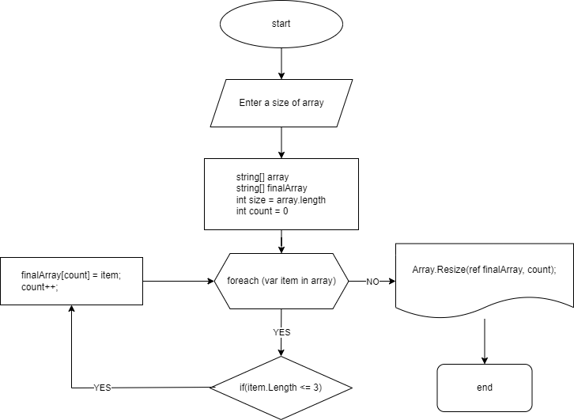

**Задача:**
Написать программу, которая из имеющегося массива строк формирует новый массив из строк, длина которых меньше, либо равна 3 символам. Первоначальный массив можно ввести с клавиатуры, либо задать на старте выполнения алгоритма. При решении не рекомендуется пользоваться коллекциями, лучше обойтись исключительно массивами.

*Примеры: ["Hello", "2", "world", ":-)"] → ["2", ":-)"] ["1234", "1567", "-2", "computer science"] → ["-2"] ["Russia", "Denmark", "Kazan"] → []*

**Решение:**
1. Блок схема решения задачи

2. Пользователь задаёт размер массива (size) и заполняет массив (array) значениями через консоль
3. Создаем новый массив finalArray
4. Проверяем каждый элемент массива array на выполнения условия:
* Если условие выполняется, увеличиваем count на 1, добавляем элемент в массив finalArray и переходим к проверке следующего элемента массива
* Если условие не выполняется, переходим к проверке следующего элемента массива
5. Изменяем размер финального одномерного массива (finalArray) и выводим его в консоль